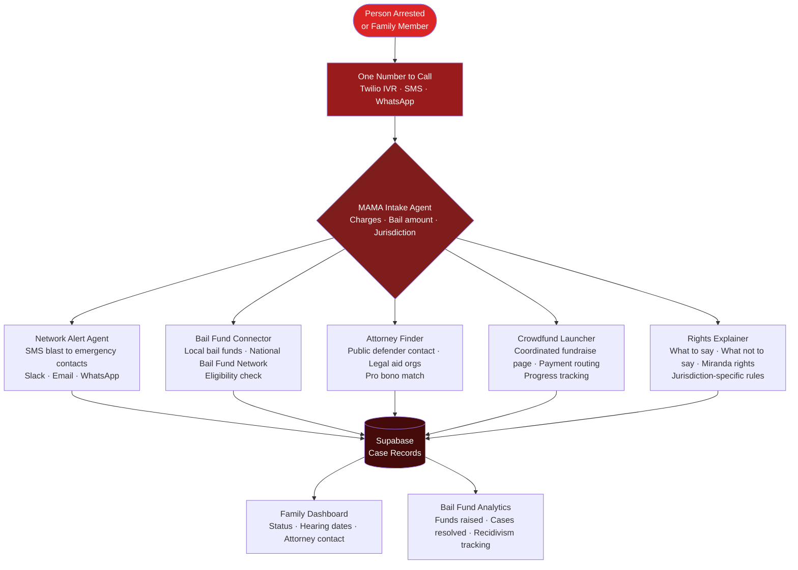

<p align="center">
  <h1 align="center">mama-bailconnect</h1>
  <h3 align="center"><em>AI bail assistance — call one number, alert your network, crowdfund bail.</em></h3>
</p>

<p align="center">
  <a href="LICENSE"></a>
  
  
  <a href="https://mama.oliwoods.ai"></a>
  <a href="https://mama.oliwoods.ai/foundation"></a>
</p>

---

> *"The median bail amount in America is $10,000. The median person who can't make bail earns $16,000 a year. We don't have a bail system — we have a wealth test."*
> — **Prison Policy Initiative, 2022** | 500,000 people sit in US jails pretrial — not convicted of anything — because they can't afford bail.

---

## Why This Exists

Pretrial detention is one of the most consequential and least-discussed drivers of mass incarceration. People lose jobs, housing, and custody of children — not because they were found guilty, but because they couldn't afford to leave.

- **500,000 people** are held in US jails on any given day awaiting trial, not yet convicted — BJS 2023
- People who can't make bail are **3–4x more likely** to accept a guilty plea and receive longer sentences — Princeton Eviction Lab / PPI 2022
- Pretrial detention costs **$14 billion annually** — paid by taxpayers, not the accused — Pretrial Justice Institute 2022
- **Black defendants** receive bail amounts 35% higher than white defendants for similar charges — Arnold Foundation 2022
- **Two-thirds of people** in local jails are there for nonviolent offenses — BJS Jail Inmates Survey 2023

**We built this because freedom before trial shouldn't depend on your bank account.**

---

## System Architecture



---

## Features

| Feature | What It Does | Partners / Data |
|---|---|---|
| **One-Call Intake** | IVR + SMS intake collects charges, bail amount, facility, and contacts in under 5 minutes | Twilio, facility lookup API |
| **Network Alert** | Instantly notifies emergency contacts via SMS, WhatsApp, email, and Slack | Twilio, SendGrid |
| **Bail Fund Connector** | Matches to local bail funds by jurisdiction and charge type | National Bail Fund Network directory |
| **Attorney Finder** | Surfaces public defender contact, legal aid orgs, and pro bono matches | LSC, state bar pro bono rosters |
| **Crowdfund Launcher** | Generates a shareable fundraising page with payment routing and progress tracking | Stripe, GoFundMe API |
| **Rights Explainer** | Plain-language Miranda rights, what to say/not say, jurisdiction-specific rules | ACLU, National Lawyers Guild |
| **Hearing Tracker** | Automated reminders for court dates, attorney calls, and bail review hearings | Court date APIs by county |

### Platform Capabilities
- **One Phone Number** — accessible via call, text, or WhatsApp with no app required
- **Offline-First** — SMS-only mode for people with no smartphone or internet access
- **15+ Languages** — intake available in Spanish, French, Haitian Creole, and 12 more
- **Privacy-First** — case details never shared without explicit consent

---

## Quick Start

```bash
git clone https://github.com/OliWoods-Org/mama-bailconnect.git
cd mama-bailconnect
npm install
npm run dev
```

## Tech Stack

- **Runtime:** Node.js + TypeScript
- **Validation:** Zod schemas
- **Database:** Supabase (PostgreSQL)
- **AI:** Claude API / local LLM
- **Communications:** Twilio (IVR, SMS, WhatsApp), Resend (email)
- **Payments:** Stripe (crowdfund routing)

---

## Research & Citations

- Prison Policy Initiative. (2022). *Detaining the Poor: How Money Bail Perpetuates an Endless Cycle of Poverty and Jail Time*. prisonpolicy.org
- Bureau of Justice Statistics. (2023). *Jail Inmates in 2022*.
- Pretrial Justice Institute. (2022). *The Cost of Money Bail*.
- Arnold Ventures. (2022). *Racial and Ethnic Disparities in the Pretrial System*.
- American Civil Liberties Union. (2023). *The Bail Trap*. aclu.org

---

## Contributing

We welcome contributions. This is open source because we believe in community-driven solutions.

1. Fork the repo
2. Create a feature branch (`git checkout -b feat/your-feature`)
3. Commit your changes
4. Push and open a PR

## License

AGPL-3.0 — Free to use, modify, and distribute.

---

<p align="center">
  <strong>Built by the <a href="https://oliwoods.ai">OliWoods Foundation</a></strong><br>
  <em>Free forever. Open source. Because innocent until proven guilty shouldn't have a price tag.</em>
</p>
